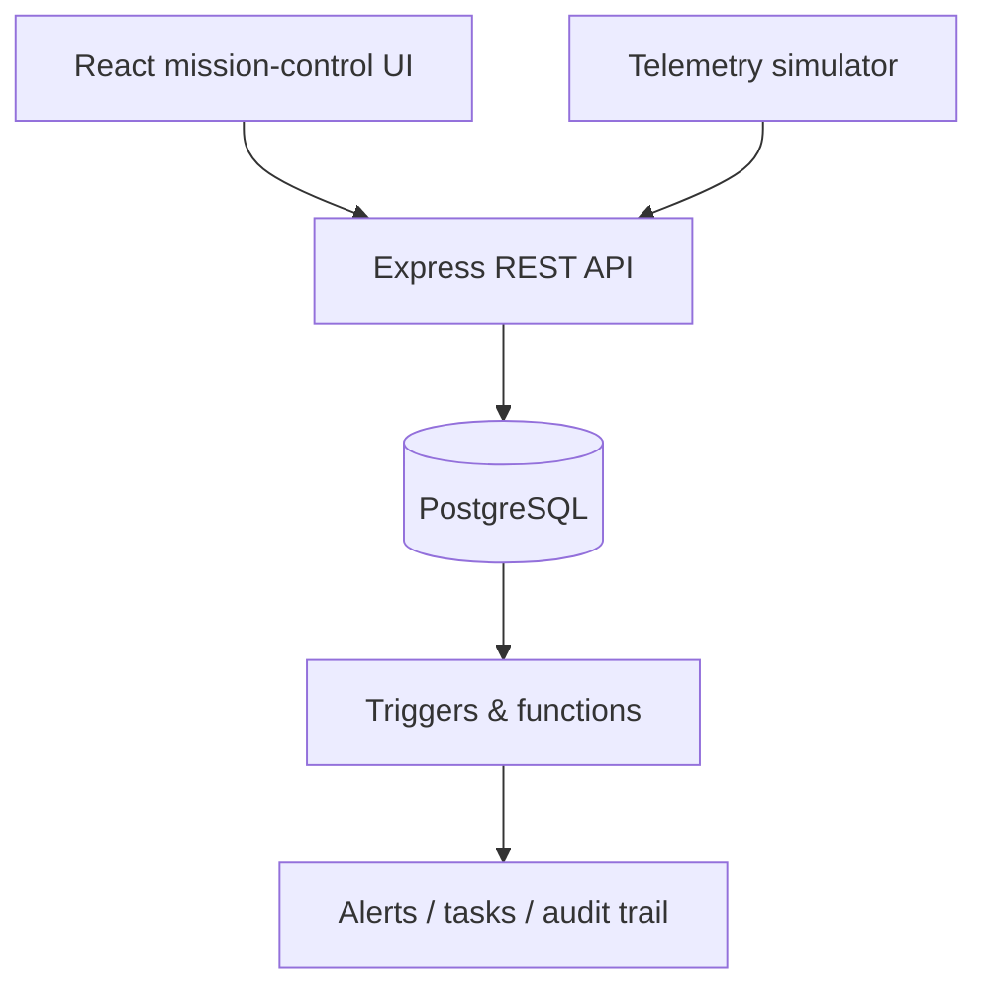
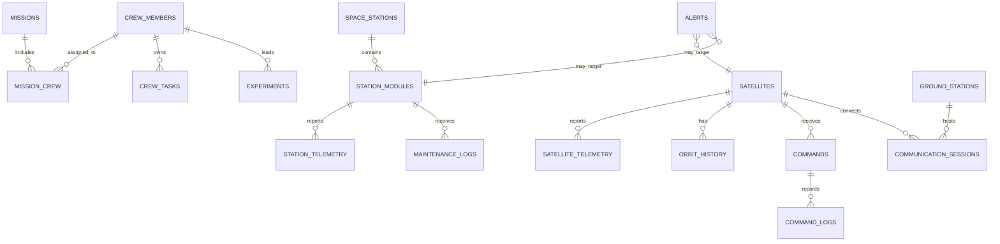

# ORBITOPS architecture and ER design

## Architecture

## Core relationships

## Design choices

- `alerts` can point to either a satellite or a station module. A check constraint prevents both targets at once.
- Raw telemetry is kept separate from the latest operational summary; views calculate the dashboard summary.
- Mission-to-crew is many-to-many through `mission_crew`.
- Command state changes are immutable rows in `command_logs`.
- The trigger only creates one open alert per target/type, avoiding alert spam.

## Build phases

1. **Database core** — schema, seed records, trigger-driven alerts, useful views.
2. **Backend** — REST endpoints, transaction for command creation and deterministic telemetry simulator.
3. **Frontend** — Dashboard, Station, Crew, Experiments, Satellites, Ground Stations, Command Center and Alerts.
4. **Demo polish** — role login, responsive layout, test script, screenshots, viva explanation.
